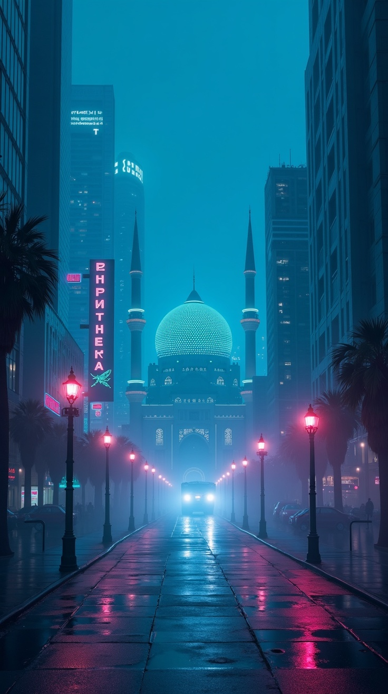

# Suniyku ☀️

**Bir jumla yozing — bir daqiqada tayyor rasm. To'g'ridan-to'g'ri Telegram'da.**

---

## Bu nima?

Suniyku — ilova emas, sayt emas. **Telegram botining o'zi.** Ro'yxatdan
o'tish yo'q, kartasiz, ilova o'rnatmasdan — botni ochasiz, nima kerakligini
yozasiz, sun'iy intellekt bir necha soniyada yaratadi.

> **Siz:** "kuz o'rmonida sinematik tulki, oltin yorug'lik"
> **Bot:** *Rasm tayyor.* 🎨
> **Siz:** "buni videoga aylantir"
> **Bot:** *Video tayyor.* 🎬

## AI qanday natija beradi — haqiqiy misollar

Quyidagilar Suniyku'ning o'zi yaratgan haqiqiy natijalar (reklama uchun ishlatilgan):

<table>
<tr>
<td width="33%">"chavandoz, tog'da quyosh botishi"</td>
<td width="33%">"kelajak Toshkenti, neon"</td>
<td width="33%">"multfilm uslubida: bola va mushuk"</td>
</tr>
<tr>
<td width="33%">mahsulot suratga olish</td>
<td width="33%">studiya portreti, milliy uslub</td>
<td width="33%">3D xarakter</td>
</tr>
</table>

Yana ko'proq, doim yangilanadigan: **[t.me/suniyku_showcase](https://t.me/suniyku_showcase)**

## Nima qila olasiz

- 🎨 **Rasm** — bir jumladan yuqori sifatli surat, turli uslub va nisbatda
- 🖼 **Tahrirlash** — bor rasmingizni so'z bilan o'zgartiring: fon, uslub, sifat
- 🎬 **Video** — matn yoki rasmdan qisqa video, suratingiz jonlanadi
- 👗 **Kiyim kiydirish** — onlayn sotuvchilar uchun mahsulot suratlari
- 🎵🎙 **Musiqa va ovoz** — tavsifdan musiqa, matndan tabiiy ovoz
- 🏷 **Marketpleys kartochka** — mahsulot rasmidan tayyor sotuv kartochkasi ([Savdoku](https://github.com/akhatovgayratjon/savdoku) bilan birga ishlaydi)

## Qanday ishlaydi

1️⃣ [**@suniyku_bot**](https://t.me/suniyku_bot?start=c_github) ni oching
2️⃣ Nima kerakligini yozing yoki tugmani bosing
3️⃣ Bir necha soniyada natijangiz tayyor

## Nega Suniyku?

- **Obuna yo'q.** Faqat ishlatganingizga to'laysiz — ☀️ Suns krediti bilan.
- **Birinchi rasmingiz — bepul.** Sinov muddati yo'q, karta so'ralmaydi.
- **To'lov qulay.** Click (so'mda) yoki Telegram Stars.
- **Ilova shart emas.** Hammasi Telegram ichida.
- **7 tilda.** O'zbek, rus, ingliz, ispan, arab, fors, turk.

## Savollar

**Rostdan ham bepulmi?**
Birinchi rasmingizni bepul yaratasiz — to'lovsiz va kartasiz (belgilangan uslublarda). Undan keyin ☀️ Suns kerak bo'ladi: Click yoki Telegram Stars orqali.

**Ilova o'rnatishim kerakmi?**
Yo'q. Suniyku to'liq Telegram ichida ishlaydi.

**Yaratgan rasmim kimniki?**
Natija sizniki — yuklab olib ishlatishingiz mumkin.

---

### [🚀 Hozir sinab ko'ring →](https://t.me/suniyku_bot?start=c_github)

[Kanal](https://t.me/suniyku) · [Ishlar galereyasi](https://t.me/suniyku_showcase) · [Sayt](https://suniyku.uz)

---

Bu repo faqat tanishtiruv (marketing) maqsadida. Suniyku mahsulotining
manba kodi ochiq emas. © 2026 Suniyku. Barcha huquqlar himoyalangan.
